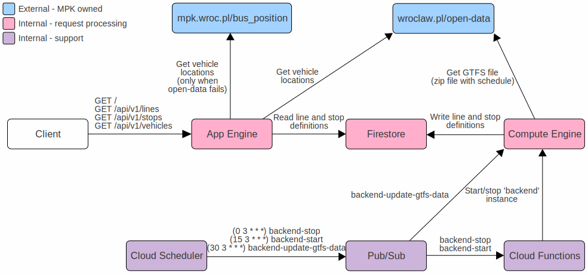
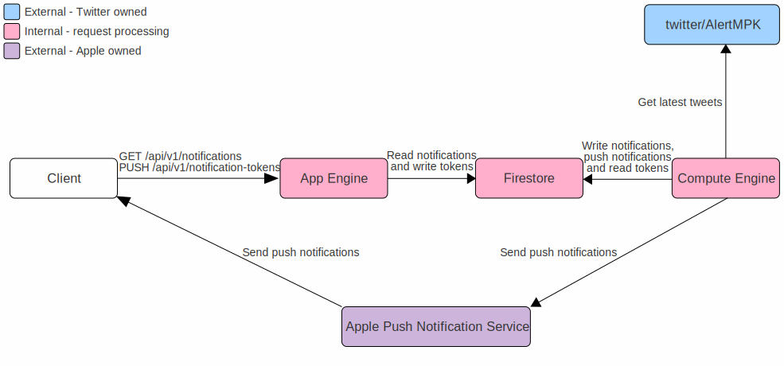

# Wroclive - Real-time public transport in Wrocław

This repository contains sources of server part of [Wroclive iOS app](https://www.wroclive.app).

(Psst… the app itself is also [open-sourced](https://github.com/LiarPrincess/Wroclive-client)!)

## Organization and configuration

We use [Google Cloud](https://cloud.google.com/) for hosting.

We extensively use their [free tier](https://cloud.google.com/free), to keep our hosting costs low. The only thing that we actually pay for is storage for [App Engine](https://cloud.google.com/appengine) instances, but this is about 0.20 zł (~$0.05) per month (only the instances in US are free and we chose Frankfurt because of [GDPR](https://ec.europa.eu/info/law/law-topic/data-protection/eu-data-protection-rules_en) and latency).

Anyway, this is how it works:

And this is the push notification pipeline:

[App Engine](https://cloud.google.com/appengine)
- Handles all traffic to [wroclive.app](https://wroclive.app/) and [wroclive.app/api](https://wroclive.app/api)
- Runs code from [AppEngine](AppEngine) directory
- Every 1h it fetches MPK data (for example available lines and stop locations) from `Firestore`
- Every 5 seconds it fetches new vehicle locations from [wroclaw.pl/open-data](https://www.wroclaw.pl/open-data/)
- If you want to deploy it yourself (`make deploy`), then remember to put `GCP-Credentials.json` for `app-engine-firestore` service account in [AppEngine directory](AppEngine)

[Firestore](https://cloud.google.com/firestore)
- Stores persistent data:
  - lines - filled by `ComputeEngine-Updater`
  - stops - filled by `ComputeEngine-Updater`
  - notifications - filled by `ComputeEngine-Notifications`
  - push notification tokens - filled by `AppEngine`
  - send push notifications - filled by `ComputeEngine-Notifications`

[Compute Engine](https://cloud.google.com/compute)
- Single instance named `backend`
- Runs code from following directories:
  - [ComputeEngine](ComputeEngine)
    - Manage `ComputeEngine` instance (installations, updates etc.)
    - Update flow:
      - `make package` to create `.zip` package with all of the `ComputeEngine` modules
      - `make upload` to send package to `GCP`
      - `make connect` to log into `GCP`
      - (on VM) `install-package.sh`
      - `exit`
      - `make restart` to restart VM (if needed)
  - [ComputeEngine-Updater](ComputeEngine-Updater)
    - Simple app that downloads [GTFS](https://developers.google.com/transit/gtfs) file from [wroclaw.pl/open-data](https://www.wroclaw.pl/open-data/) and upload it to `Firestore`
    - Uses [sqlite.org](https://www.sqlite.org/index.html) for intermediate processing
    - Before installing remember to put `GCP-Credentials.json` for `compute-engine-firestore` service account in [ComputeEngine-Updater directory](ComputeEngine-Updater)
  - [ComputeEngine-PubSub](ComputeEngine-PubSub)
    - `Pub/Sub` subscriber
    - After receiving `backend-update-gtfs-data` message runs `ComputeEngine-Updater`
    - Starts when the `Compute Engine` instance starts
    - Before installing remember to put `GCP-Credentials.json` for `pubsub` service account in [ComputeEngine-PubSub directory](ComputeEngine-PubSub)
  - [ComputeEngine-Notifications](ComputeEngine-Notifications)
    - Gets latest tweets from [@AlertMPK](https://twitter.com/AlertMPK) and sends them as push notifications
    - Stores notifications in `Firestore`
    - Starts when the `Compute Engine` instance starts
    - Before installing remember to put following in [ComputeEngine-Notifications](ComputeEngine-Notifications) directory:
      - `GCP-Credentials.json` for `compute-engine-firestore` service account
      - `Twitter-Credentials.json` - see `Twitter-Credentials-example.json` for details
      - `APN-Key.p8` - key for Apple Push Notification service
      - `APN-Credentials.json` - see `APN-Credentials-example.json` for details

[Cloud Functions](https://cloud.google.com/functions)
- Runs code from [CloudFunctions](CloudFunctions) directory
- `backendStart` function
  - Looks for `backend` instance on `Compute Engine` and starts it
  - Scheduled by `Cloud Scheduler`
- `backendStop` function
  - Looks for `backend` instance on `Compute Engine` and stops it
  - scheduled by `Cloud Scheduler`

[Pub/Sub](https://cloud.google.com/pubsub) - following topics need to be created:
- `backend-stop`
- `backend-start`
- `backend-update-gtfs-data`

[Cloud Scheduler](https://cloud.google.com/scheduler)
- Every day at 1am (`0 3 * * *`): publish `backend-stop` message on `Pub/Sub`
- Every day at 5am (`15 3 * * *`): publish `backend-start` message on `Pub/Sub`
- Every day at 3am (`30 3 * * *`): publish `backend-update-gtfs-data` message on `Pub/Sub`

[IAM & Admin](https://cloud.google.com/iam) - following service accounts are used:

- `App Engine default service account`
  - automatically created by `App Engine`
  - no configuration needed

- `app-engine-firestore` - account used by `App Engine` to read/write data in `Firestore`
  - Role: Viewer, Editor
  - Key should be exported and placed in [AppEngine](AppEngine)

- `compute-engine-firestore` - account used in `ComputeEngine-Updater` and `ComputeEngine-Notifications` to read/write data in `Firestore`
  - Role: Owner
  - Key should be exported and placed in [ComputeEngine-Updater](ComputeEngine-Updater) and [ComputeEngine-Notifications](ComputeEngine-Notifications)

- `pubsub` - account used for creating subscriptions in `ComputeEngine-PubSub`
  - Roles: Editor, Pub/Sub Publisher, Pub/Sub Subscriber
  - Key should be exported and placed in [ComputeEngine-PubSub](ComputeEngine-PubSub)

[Monitoring](https://cloud.google.com/service-monitoring)
- SSL certificate expiring soon
  - Alert: 7 days prior
- Uptime check on `wroclive.app/api` (this will also keep our `App Engine` instance alive)
  - Protocol: HTTPS
  - Hostname: wroclive.app
  - Path: api
  - Check frequency: 10 minutes
  - Regions: Europe

[Cloud Logging](https://cloud.google.com/logging)
- We use [winstonjs/winston](https://github.com/winstonjs/winston) with `@google-cloud/logging-winston` backend
- Add following filers:
  - App Engine life cycle
    - Query: `resource.type="gae_app" AND (textPayload=~"(Starting app|Quitting on terminated signal)$" OR protoPayload.methodName="google.appengine.v1.Versions.CreateVersion")`
  - Api by user agent
    - Query: `protoPayload.userAgent =~ "Wroclive.*"`

[Error reporting](https://cloud.google.com/error-reporting) - standard reporting by mail

## Additional files

- [siege](siege)
  - preset to `Unix siege` tool + baseline - used to check burst performance
  - tiny module written in Python to check sustained performance

- [postman.json](postman.json) - configuration file to import into [postman](https://www.postman.com) app (it contains our endpoints + some basic tests)

## License

Wroclive is licensed under the Mozilla Public License 2.0 license.
See [LICENSE](LICENSE) for more information.
